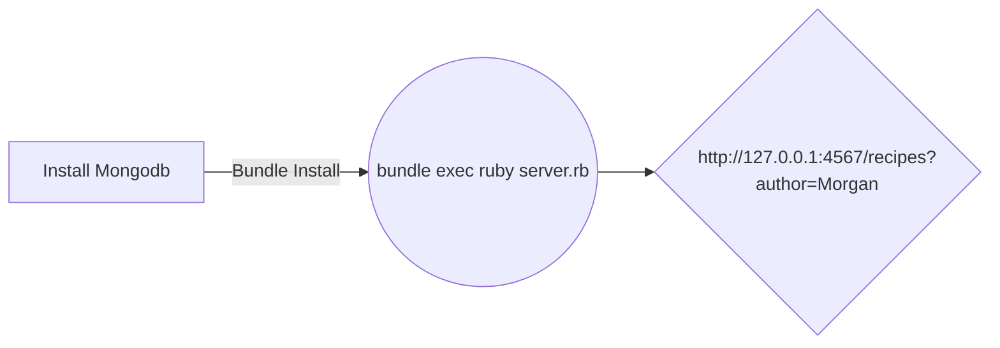

# Recipe API Instructions

## Installation Overview

## Installing MongoDB
We'll use MongoDB to persist data.
This assumes an OSX environment so I'm using **brew** from the **Homebrew** : see `https://brew.sh/` for installation instructions.

Run: `install_mongodb_osx.sh`

## Stopping and starting MongoDB
Run `mongodbctl {start|stop}`

## Install gems from Gemfile and dependencies
Run: `gem install bundler`
Run: `bundle install`
Run: `geminstaller`

## Starting the backend API server
Run: `bundle exec ruby server.rb`

## Using irb to create new Recipes
We'll use **irb** so run this in a terminal session:

    $irb
#
Once you are inside, run the command require './server' to load the application inside irb:
#
    irb(main):001:0> require './server'
=> true
#
Then run this one to create the indexes for the Recipe model:
    irb(main):001:0>Recipe.create_indexes
=> true
#
Finally, here are some sample recipes to populate the database. Just run each command in `irb` to get them persisted inside the MongoDB database.

    Recipe.create(title:'Chicken Soup', author:'Morgan', process:'Add all ingredients to a pot of water and simmer', description:'A tasty chicken soup recipe',ingredients:'Chicken, celery, carrots, onion, garlic, thyme, salt, water')

    Recipe.create(title:'Steak and Pie', author:'Lazlo', process:'Make a puff pastry top and bake in the oven, add the rest of the ingredients to small pot and simmer', description:'A puff pastry topped pie',ingredients:'Ribeye steak, celery, carrots, onion, garlic, thyme, salt, water')

    Recipe.create(title:'Lamb Tagine', author:'Morgan', process:'Add all ingredients to a tagine and slowly cook in the oven', description:'A Morrocan lamb tagine',ingredients:'Lamb cubes, celery, carrots, onion, garlic, prunes, salt, water, saffron, cinnamon, honey,turmeric, ginger, coriander')

    Recipe.create(title:'Creamy Mushroom Soup', author:'Steve', process:'Add all ingredients to a pot of water and simmer', description:'A tasty mushroom soup recipe',ingredients:'Wild mushrooms, celery, carrots, onion, garlic, thyme, salt, water')

    Recipe.create(title:'Creamy Chicken Soup', author:'Lazlo', process:'Add all ingredients to a pot of water and simmer', description:'A tasty chicken soup recipe',ingredients:'Chicken, celery, carrots, onion, garlic, thyme, salt, water')

# 

## Using a web browser to view the Get results

- Point your browser to: http://localhost:4567/recipes to see all recipes
- We've also created a versioned API with namespaces so ..
- To search for a particular author with namespaces: http://localhost:4567/api/v1/recipes?author=Morgan

- To search for a particular author: http://localhost:4567/recipes?author=Morgan
- To perform a regex search on **title**: http://localhost:4567/api/v1/recipes?title=Soup

## POSTing new recipes
Run: `curl_command_post_cherry_pie.sh`

## PATCHing recipes / UPDATE
Run: `curl_command_patch_cherry_pie.sh`

## Deleting Recipes
We'll use **curl** for this to access the Recipe API backend

 - `curl -i -X DELETE -H "Content-Type: application/json" http://localhost:4567/api/v1/recipes/Chicken%20Soup`
